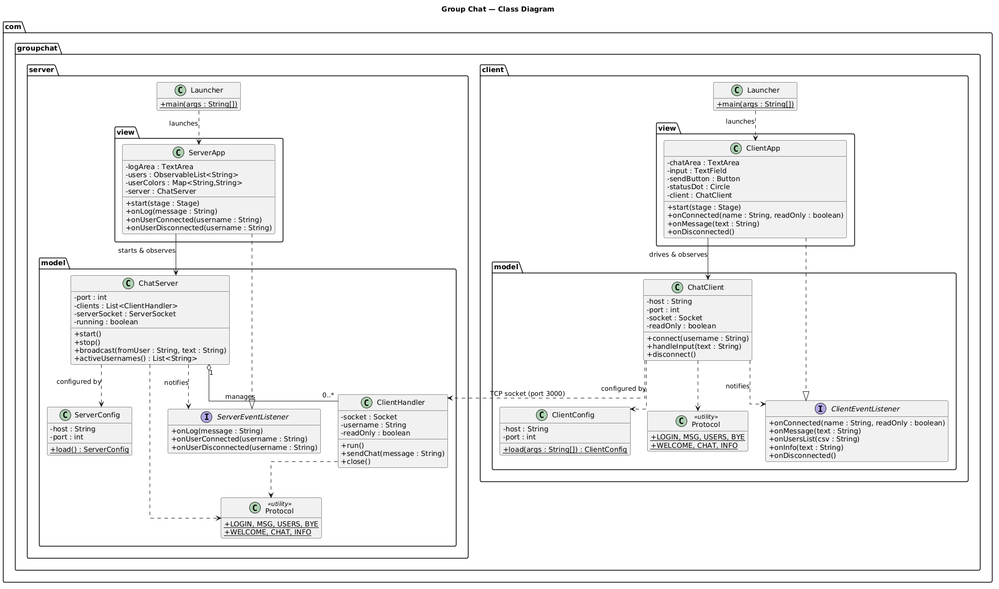
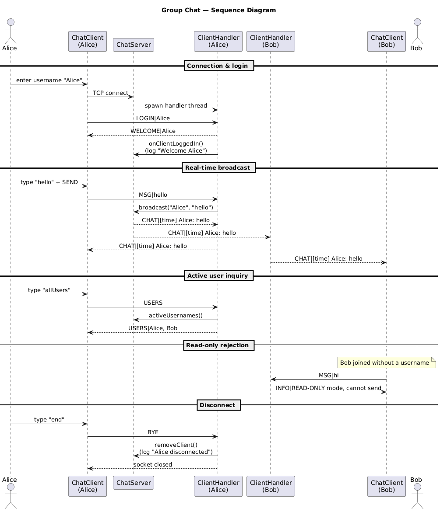
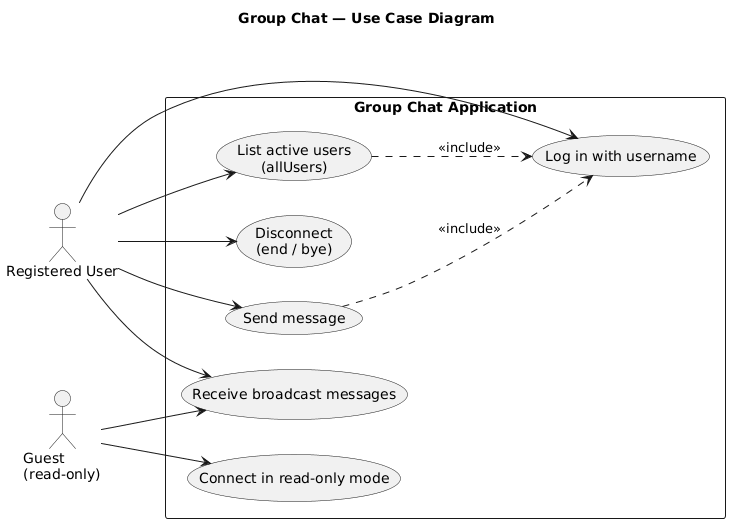
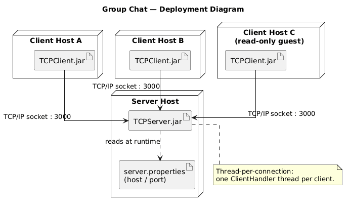

# Group Chat (TCP + JavaFX)

A small real-time group chat written with Java sockets and JavaFX. One server sits
in the middle and relays messages between everyone connected to the same room.

The repo is two Maven projects tied together by a parent POM:

- `TCPServer` — the server UI. Accepts connections, forwards messages, keeps a log,
  and lists who's online.
- `TCPClient` — the client UI. Pick a username, then send and read messages.

## What it does

On the client side you log in with a username before you can chat. If you leave the
username blank you still connect, but in read-only mode — you can follow along but
the input box stays disabled. Once you're in, type a message and press Enter (or hit
SEND). Typing `allUsers` asks the server who's currently connected, and `end` or `bye`
disconnects you cleanly. There's a small Online/Offline label with a coloured dot so
you can tell the connection state at a glance.

The server handles several clients at once, one thread per connection. Every message
gets tagged with the sender's name and the time before it goes back out to everyone.
Connected users show up in a list, each with a random background colour so they're
easy to tell apart, and the activity log records the interesting events — startup,
new clients, broadcasts, disconnects.

## How it's put together

It's a plain server–client setup, and the networking is kept separate from the UI so
neither one depends on the other:

```
com.groupchat.server
├── Launcher                 plain main(), launches the JavaFX app
├── model/                   no JavaFX in here
│   ├── ChatServer           accept loop, broadcast, user registry
│   ├── ClientHandler        one per connection (own thread)
│   ├── ServerConfig         host/port from server.properties
│   ├── ServerEventListener  model talks to the view through this
│   └── Protocol             the wire format
└── view/
    └── ServerApp            JavaFX UI, implements ServerEventListener

com.groupchat.client
├── Launcher
├── model/                   no JavaFX in here
│   ├── ChatClient           connect, send, background reader thread
│   ├── ClientConfig         host/port (args win over properties)
│   ├── ClientEventListener
│   └── Protocol
└── view/
    └── ClientApp            JavaFX UI, implements ClientEventListener
```

The model layer never imports JavaFX — it only reaches the UI through the
`*EventListener` interfaces. So in principle you could drop in a CLI or web front end
without touching the socket code.

For concurrency the server uses thread-per-connection: an acceptor thread blocks on
`ServerSocket.accept()` and hands each new socket to its own `ClientHandler` thread.
That's plenty for a classroom-sized room. If you ever needed to handle a huge number
of clients, the usual next step is a single thread with an NIO `Selector` multiplexing
the sockets — left out here on purpose to keep things readable.

### Wire protocol

Messages are newline-delimited UTF-8 text, shaped like `TYPE|payload`:

| Direction        | Frame                                       | Meaning                                 |
|------------------|---------------------------------------------|-----------------------------------------|
| client → server  | `LOGIN\|<username>`                         | First frame; empty username = read-only |
| client → server  | `MSG\|<text>`                               | Send a chat message                     |
| client → server  | `USERS`                                      | Ask for the active-user list            |
| client → server  | `BYE`                                         | Graceful disconnect                     |
| server → client  | `WELCOME\|<username>` / `WELCOME\|READONLY` | Login acknowledged                      |
| server → client  | `CHAT\|[time] user: text`                   | A message to display                    |
| server → client  | `USERS\|a, b, c`                            | Response to `allUsers`                  |
| server → client  | `INFO\|<text>`                              | System notice                           |

## Diagrams

### Class diagram


### Sequence diagram


### Use case diagram


### Deployment diagram


## Configuration

Network settings are read at runtime, so you don't recompile to change them. They're
resolved in this order:

1. command-line arguments (client only): `<serverIp> <port>`
2. an external `server.properties` / `client.properties` next to the JAR
3. the bundled properties file
4. built-in defaults (`localhost:3000`)

`TCPServer/src/main/resources/server.properties`
```properties
server.host=0.0.0.0
server.port=3000
```

`TCPClient/src/main/resources/client.properties`
```properties
server.host=localhost
server.port=3000
```

## Building

You'll need JDK 21+ and Maven 3.9+.

```bash
mvn clean package
```

That produces the two runnable JARs:

- `TCPServer/target/TCPServer.jar`
- `TCPClient/target/TCPClient.jar`

The JARs bundle the JavaFX libraries for whatever platform you build on, so build on
the OS you plan to run on. Or skip the JARs and use `mvn javafx:run`, which pulls the
right JavaFX binaries for you.

## Running

During development the Maven plugin is the easy path:

```bash
# server
mvn -pl TCPServer javafx:run

# client (open more terminals for more clients)
mvn -pl TCPClient javafx:run
```

Or run the JARs directly:

```bash
java -jar TCPServer/target/TCPServer.jar
java -jar TCPClient/target/TCPClient.jar localhost 3000
```

To see it work: start the server (the log shows `Server Started` and
`Waiting for Client ...`), start a client and pick a username — you'll appear in the
server's user list. Open another client, send a message, and both clients get it in
real time. `allUsers` shows who's online, and leaving the username blank gives you a
read-only client. `end`, `bye`, or just closing the window disconnects you.

## Stack

Java 21, plain TCP sockets for the networking, JavaFX for the UI (CSS-styled), and
Maven for the multi-module build with the shade plugin producing the executable JARs.
Developed in IntelliJ IDEA.
</content>
