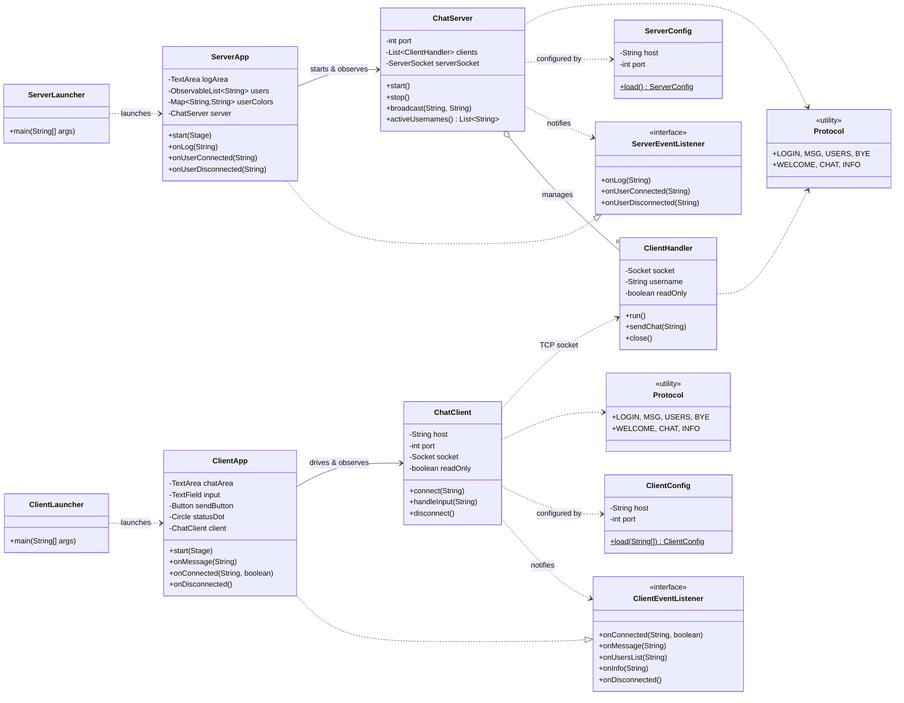

# Class Diagram

Software structure and relationships. The **model** packages contain all logic and
socket handling; the **view** packages contain only JavaFX code and talk to the model
through the listener interfaces — enforcing the Separation of Concerns requirement.

