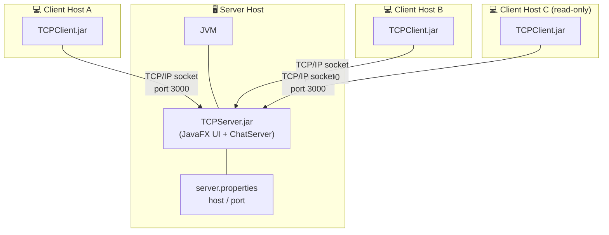
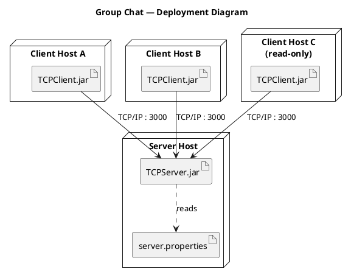

# Deployment Diagram

Physical network nodes (one **Server** node, many **Client** nodes) and the TCP/IP
communication links between them.

A Mermaid view is shown first for quick reading. Below it is a **PlantUML** version
using true UML deployment notation (`node` / `artifact`) — render it in IntelliJ with
the PlantUML Integration plugin, or at <https://www.plantuml.com/plantuml>.

## Mermaid (quick view)

## PlantUML (formal UML deployment)

