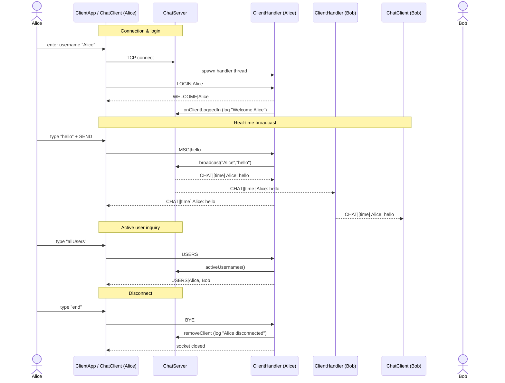

# Sequence Diagram

Message flow for the main interactions: login, broadcast, `allUsers`, and disconnect.

```mermaid
sequenceDiagram
    actor Alice
    participant CA as ClientApp / ChatClient (Alice)
    participant S as ChatServer
    participant HA as ClientHandler (Alice)
    participant HB as ClientHandler (Bob)
    participant CB as ChatClient (Bob)
    actor Bob

    Note over CA,S: Connection & login
    Alice->>CA: enter username "Alice"
    CA->>S: TCP connect
    S->>HA: spawn handler thread
    CA->>HA: LOGIN|Alice
    HA-->>CA: WELCOME|Alice
    HA->>S: onClientLoggedIn (log "Welcome Alice")

    Note over CA,CB: Real-time broadcast
    Alice->>CA: type "hello" + SEND
    CA->>HA: MSG|hello
    HA->>S: broadcast("Alice","hello")
    S-->>HA: CHAT|[time] Alice: hello
    S-->>HB: CHAT|[time] Alice: hello
    HA-->>CA: CHAT|[time] Alice: hello
    HB-->>CB: CHAT|[time] Alice: hello

    Note over CA,S: Active user inquiry
    Alice->>CA: type "allUsers"
    CA->>HA: USERS
    HA->>S: activeUsernames()
    HA-->>CA: USERS|Alice, Bob

    Note over CA,S: Disconnect
    Alice->>CA: type "end"
    CA->>HA: BYE
    HA->>S: removeClient (log "Alice disconnected")
    HA-->>CA: socket closed
```
