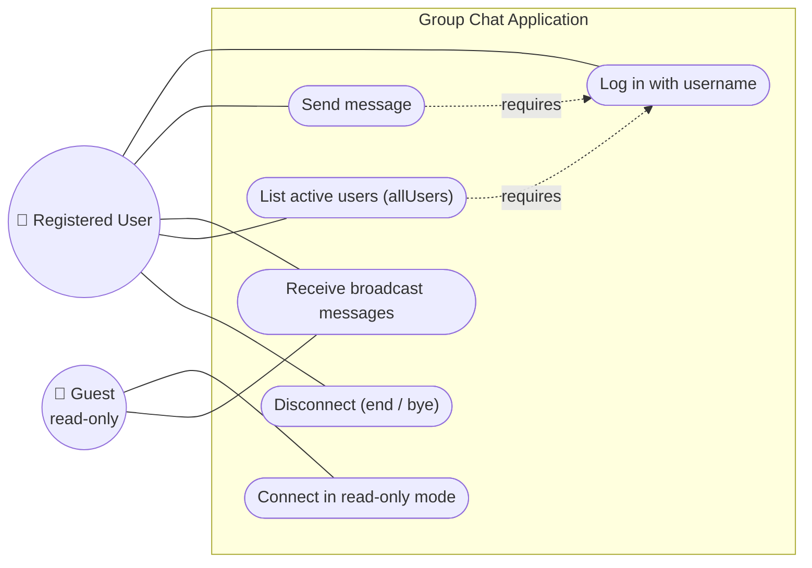

# Use Case Diagram

User interactions with the system. A **Registered User** provides a username; a
**Guest** connects without one and is limited to read-only viewing.

```mermaid
flowchart LR
    user(("👤 Registered User"))
    guest(("👤 Guest<br/>read-only"))

    subgraph System["Group Chat Application"]
        uc1(["Log in with username"])
        uc2(["Send message"])
        uc3(["Receive broadcast messages"])
        uc4(["List active users (allUsers)"])
        uc5(["Disconnect (end / bye)"])
        uc6(["Connect in read-only mode"])
    end

    user --- uc1
    user --- uc2
    user --- uc3
    user --- uc4
    user --- uc5

    guest --- uc6
    guest --- uc3

    uc2 -. requires .-> uc1
    uc4 -. requires .-> uc1
```
